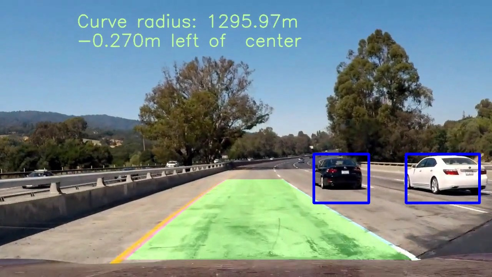
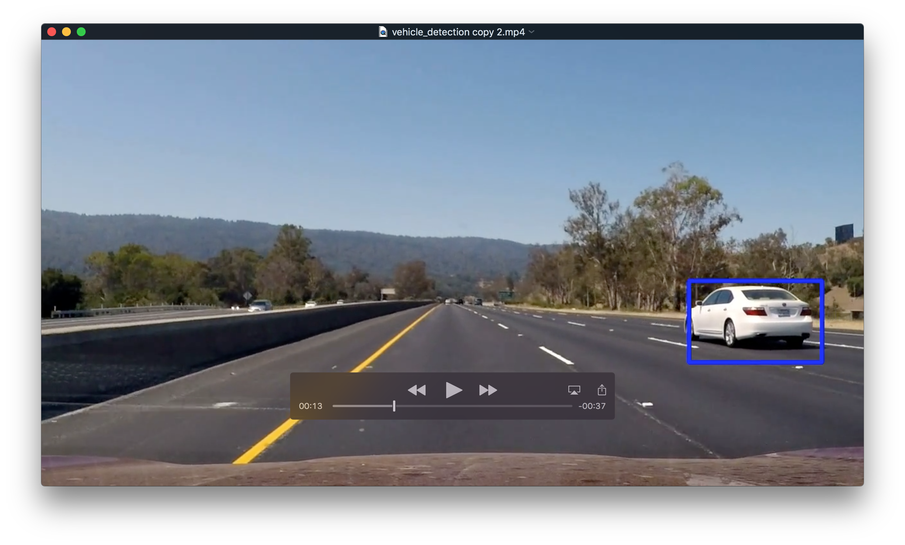

# Vehicle Detection Project

[](http://www.udacity.com/drive)

Overview
---
This repository contains my submission for the Vehicle Detection Project, which is the fifth and final project in term 1 of the Udacity Self-Driving Car Engineer Nanodegree Program. The goal of this project is to write a software pipeline to identify vehicles in a video from a front-facing camera on a car.


The steps used to complete this project are as follows:

* Perform a Histogram of Oriented Gradients (HOG) feature extraction on a labeled set of training images
* Train a Linear SVM classifier
* Randomize a selection for training and testing
* Implement a sliding-window technique and use your trained classifier to search for vehicles in images
* Create a heat map of recurring detections frame by frame to reject outliers and follow detected vehicles
* Estimate a bounding box for vehicles detected
* Run your pipeline on a video stream 

[//]: # (Image References)

[image1]: ./visualization/hog_images.jpg "HOG visualization images"
[image2]: ./visualization/boxes_test_images_windows_img3.jpg "Scaled windows 1.5 scale"
[image3]: ./visualization/boxes_test_images_windows_img4.jpg "Scaled windows 2.0 scale"
[image4]: ./visualization/boxes_test_images_windows_img5.jpg "Scaled windows 2.5 scale"
[image5]: ./visualization/heat_test_images.jpg "Heat map"
[image6]: ./visualization/boxes_test_images.jpg "Bounding boxes"

### Files Submitted
My project includes the following files:
* [proj5.py](./proj5.py) -- contains the script to create the video and visualize intermediate images
* [vehicle_detection.mp4](./vehicle_detection.mp4) -- video showing my output for the input video called project_video.mp4 

The video can be recreated by running the following command:
```sh
python proj5.py --videofile=project_video.mp4
```
The arguments that can be passed to proj5.py are as follows:

| Argument Name     | Description                         | Default         | 
|:-----------------:|:-----------------------------------:|:---------------:| 
| visualization (v) | Figures but not videos              | False           | 
| smallset (s) | Use the smaller set of images for training| False           | 
| videofile (f)     | The input video file to use         | False           | 
| usesubclip (c)    | Use a subclip of the video         | False           | 
| subcliprange (v) | The start and end points of the subclip| False        |
| forcetrain (t) | Train even if saved pickle files are present | False    | 
                     
The following is an example of a command line that can be used just to visualize the data. 
```sh
python proj5.py --visualization=true
```
When data is visualized, jpg images of the plots are both shown on the screen and written to the following directory: ./visualization. This directory must be created manually before running the script.

## Perform a Histogram of Oriented Gradients (HOG)
I use a Histogram of Oriented Gradients (HOG) algorithm to extract a feature vector from a set of 64x64 images to train a classifier to recognize images that contain a car. A HOG feature vector uses a gradient calculated within a block of cells and then the dominant direction of the gradient in each cell is determined by taking a histogram over a specified number of bins and then grouping each cell into a histogram with the value in each bucket being the magnitude of the gradient at that direction. A HOG vector provides a one-dimensional, feature vector that is representive of the shape and structure of the contents of the image while maintaining independence of color and spatial orientation. So a HOG feature vector extracted from an image of a car will look similar to the HOG feature vector extracted from images of another car even if the orientation and color of the car is different. 

The number of cells in each block and the number of bins that are used for the histogram are parameters that have to be selected. As part of lesson 29 in the Vehicle Detection and Tracking section of the course material, I did a study of the accuracy of a classifier created using a HOG feature vector with a variety of parameter values specified. 

|colorspace|Orient|pix_per_cell|cell_per_block|channels|accuracy| 
|:--------:|:----:|-----------:|:------------:|------------:|-------:| 
|RGB|9|8|2|ALL|0.965|
|HSV|9|8|2|0|0.94|
|HSV|9|8|2|1|0.91|
|HSV|9|8|2|2|0.95|
|HSV|9|8|2|ALL|0.98|
|LUV|9|8|2|0|0.95|
|LUV|9|8|2|1|0.95|
|LUV|9|8|2|2|0.945|
|LUV|9|8|2|ALL|0.985|
|HLS|9|8|2|0|0.935|
|HLS|9|8|2|1|0.95|
|HLS|9|8|2|2|0.89|
|HLS|9|8|2|ALL|0.995|
|YUV|9|8|2|0|0.94|
|YUV|9|8|2|1|0.965|
|YUV|9|8|2|2|0.965|
|YUV|9|8|2|ALL|0.97|
|YCrCb|9|8|2|0|0.925|
|YCrCb|9|8|2|1|0.975|
|YCrCb|9|8|2|2|0.92|
|YCrCb|9|8|2|ALL|1.0|
|YCrCb|9|16|2|ALL|0.995|
|YCrCb|9|16|4|ALL|0.98|
|YCrCb|11|16|2|ALL|0.985|

As you can see, the best results were achieved using the YCrCb colorspace using all of the color channels with a number of orientations=9, a number of pixels_per_cell=8, and cells_per_block=2. I achieved a test accuracy of 100% on the dataset used in the lesson using this set of parameters. Cells_per_block specifies the local area over which the histogram counts in a given cell will be normalized. I found that using a value other than 2 for this parameter caused the accuracy to go down.  However, when I tried the 5 best performing set of parameters on the project video, I found that I got the best results using a pixels_per_cell of 16 and a number of orientations=11, so that is what I used for this project.

Figure one shows, the original image and the HOG feature vector for 4 randomly selected images from the sample data set that was provided to us. Since I use all of the channels in calculating the HOG feature vector, I show the HOG image for each channel.
![alt text][image1]

## Train a Support Vector Machine classifier
I trained a Support Vector Machine (SVM) classifier using the HOG feature vector and the set of images provided. I used grid_search.GridSearchCV method to find the best values for: kernel, C, and gamma. The best values turned out to be the following: kernel=rbf, C=1.0, gamma=auto which produced a test accuracy of 0.9789. However using a linear SVM, as was recommended in the course material, and a C value of 1.0, I was able to achieve a higher accuracy of: 0.9828, so this is what I used.

## Randomize a selection for training and testing
I used the train_test_split method from scikit-learn to split the car image data. I used an 80/20 split between training and test data and specified that the data should be randomized. The original data set of images with cars can be found [here](https://s3.amazonaws.com/udacity-sdc/Vehicle_Tracking/vehicles.zip). The images without cars can be found [here](https://s3.amazonaws.com/udacity-sdc/Vehicle_Tracking/non-vehicles.zip).

## Implement a Sliding-Window Technique
With our classifier trained, we need to search each frame of the video for the presence of a car. Depending on whether the detected car is near or far from the camera, the detected car will appear at different scale. The logic in the find_cars function creates overlapping windows of different sizes and then scales the rectangular area within each Window to 64x64 and then runs the classifier against the scaled window. It is an adaptation of the code shown in lesson 35 of the Vehicle Detection and Tracking section of the course material. Tuning the window sizes and range of pixels that would be covered was done visually. I wrote code in the find_cars function, which is my adaptation of the code provided in lesson 35,that allows me to visualize all of the windows that would be searched for specified values of the starting y position (ystart), ending y position (ystop), and the window scale (scale). When the boolean True value is specified for the visualize_windows parameter of find_cars, all of the searched windows for the specified set of parameters are shown on the screen. I generated a set of 26 images, which included both the original test images as well as problematic frames from the project video. I used this to tune the ystart, ystop, and scale values. I eventually settled on the following three sets of values for: ystart, ystop, and scale:

ystart = 400
ystop = 592
scale = 1.5
    
ystart = 400
ystop = 656
scale = 2.0

ystart = 500
ystop = 660
scale = 2.5

Figure 2 below shows the windows generated for a scale value of 1.5 (I found that a scale value of 1.0 added no value). Note that each window that will be searched encompasses 4 squares shown on the screen.
![alt text][image2]
Figure 3 shows the windows generated for a scale value of 2.0.
![alt text][image3]
Figure 4 shows the windows generated for a scale value of 2.5.
![alt text][image4]

I wrote logic in the process_image function to call find_cars with the ystart, ystop, and scale values shown above. 

## Create a Heat Map of Recurring Detections
In order to find cars within the image, I first made a heat-map, by iterating through the list of boxes in which a car is detected and adding 1 to the pixels in each box. The individual heat-maps for my test set of images looks as follows:
![alt text][image5]
We can apply a threshold (see the apply_threshold function) to estimate where cars are present in the image. Note that in one of the images the car is not detected. This is okay because I sum and apply the threshold across multiple frames when I process a video. So a "miss" within a single frame is tolerated. The parts of the heat map that are greater than the threshold is where cars are located. I integrate the heat map over 15 frames of video using a deque so that transient positives, like a car going in the other direction, don't cause a false positive. I eventually settled on half of the number frames (15) plus one as my threshold.
## Estimate a bounding box for vehicles detected
I used the label() function from scipy.ndimage.measurements, per instruction in the course material, to determine how many cars are present in each frame and which pixels belong to each car.  
## Results
My final results look good on the project video. 
.
[](./vehicle_detection.mp4) 
## Conclusions
Overall my approach worked well. There is a false positive that appears briefly on the screen at the 42 second mark of the video. My pipeline is picking up cars going in the other direction. Because the freeway divider becomes somewhat transparent at that location, the algorithm picks up a car long enough that it draws a box on the screen, but it quickly goes away. The algorithm for selecting the scaled windows and the ystart and ystop values could probably be tuned a little more. But what I currently have works well on the provided video. 

